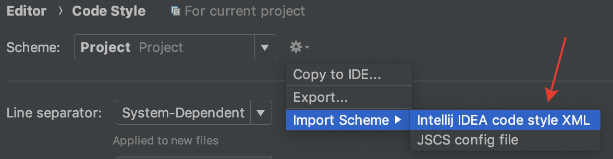

# How to start?

#### This project assumes you have brew, nvm, and yarn installed

1. Run command: `yarn`

2. Adjust your IDE

3. Run command: `yarn start`

### How should I adjust my IDE?

**We've taken steps below from this article: [Set up create-react-app](https://medium.com/stephenkoo/how-to-set-up-create-react-app-redux-react-router-redux-thunk-prettier-scss-airbnb-eslint-dda0bba5616a)**

1. Add `code_scheme` to your IDE

   - WebStorm | Preferences | Editor | Code Style
      
     

   - select file from path: `your app/ide_config/code_scheme.xml`

2. Integrate Prettier in [your editor](https://prettier.io/docs/en/editors.html).

   - For [WebStorm](https://prettier.io/docs/en/webstorm.html)

# What folders structure do we use?

**We've taken feature-centric approch for our application from the following resource:**
[React Apps: Approaching Organization / Structure / Architecture](https://medium.com/maintainable-react-apps/react-apps-approaching-organization-structure-architecture-49a281bd97eb)

# How to update packages?

yarn upgrade-interactive [--latest]
